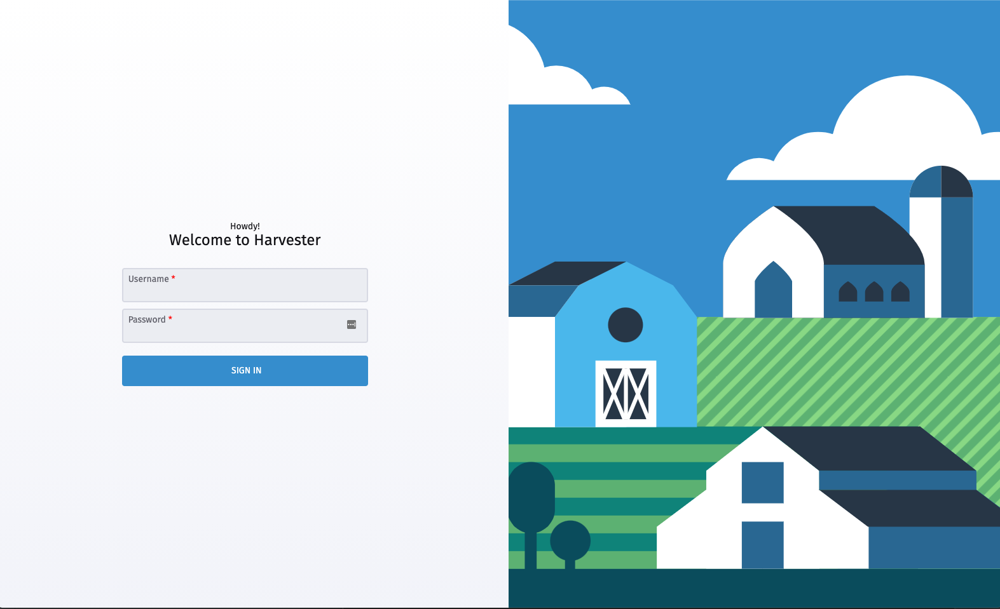

# Authentication
Harvester Dashboard supports `local auth` mode for authentication. The default username and password is `admin/password`.

The Harvester login page is shown below:

## App Mode
In `App mode`, which is intended only for development and testing purposes, more authentication modes are configurable using the environment variable `HARVESTER_AUTHENTICATION_MODE`.

The currently supported options are `localUser` (the same as `local auth` mode) and `kubernetesCredentials`.

If the `kubernetesCredentials` authentication option is used, either a kubconfig file or bearer token can provide access to Harvester.

- [Kubeconfig](#kubeconfig) file that can be used on Dashboard login view.
- [Bearer Token](#bearer-token)

### Kubeconfig

The `Kubeconfig` authentication method does not support external identity providers or basic authentication.

### Bearer Token

It is recommended to get familiar with the [Kubernetes authentication](https://kubernetes.io/docs/reference/access-authn-authz/authentication/) documentation first to find out how to get a token that can be used to log in. For example, every Service Account could have a Secret with a valid Bearer Token that can be used to log in to the dashboard.

To find out how to create a Service Account and grant it privileges, refer to the following resources in the Kubernetes documentation:

* [Service Account Tokens](https://kubernetes.io/docs/reference/access-authn-authz/authentication/#service-account-tokens)
* [Role and ClusterRole](https://kubernetes.io/docs/reference/access-authn-authz/rbac/#role-and-clusterrole)
* [Service Account Permissions](https://kubernetes.io/docs/reference/access-authn-authz/rbac/#service-account-permissions)

To create a sample user and to get its token, see the guide on [Creating sample user.](https://github.com/kubernetes/dashboard/blob/master/docs/user/access-control/creating-sample-user.md)