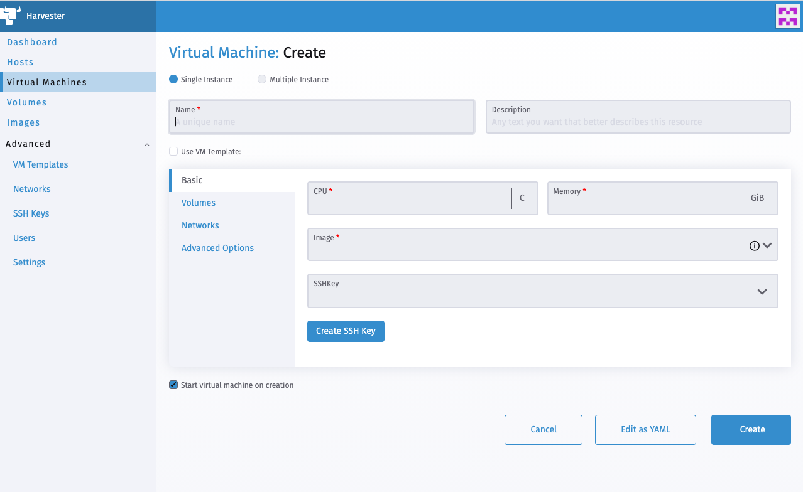

# How to Create a VM

Create one or more virtual machines from the **Virtual Machines** page.

1. Choose the option to create either one or multiple VM instances.
1. The VM name is required.
1. (Optional) you can select to use the VM template. By default we have added iso, raw, and Windows image templates.
1. Configure the CPU and Memory of the VM
1. Select a custom VM image.
1. Select SSH keys or upload a new one.
1. To add more disks to the VM, go to the **Volumes** tab. The default disk will be the root disk.
1. To configure networks, go to the **Networks** tab. The **Management Network** is added by default. It is also possible to add secondary networks to the VMs using vlan networks (configured on **Advanced > Networks**).
1. Optional: Configure advanced options like hostname and cloud-init data in the **Advanced Options** section.

#### Networks

##### Management Network

A management network represents the default vm eth0 interface configured by the cluster network solution that is present in each VM.

By default, a VM can be accessed via the management network. 

##### Secondary Network

It is also possible to connect VMs using the secondary networks with build-in vlan networks. This is powered by [Multus](https://github.com/intel/multus-cni). 